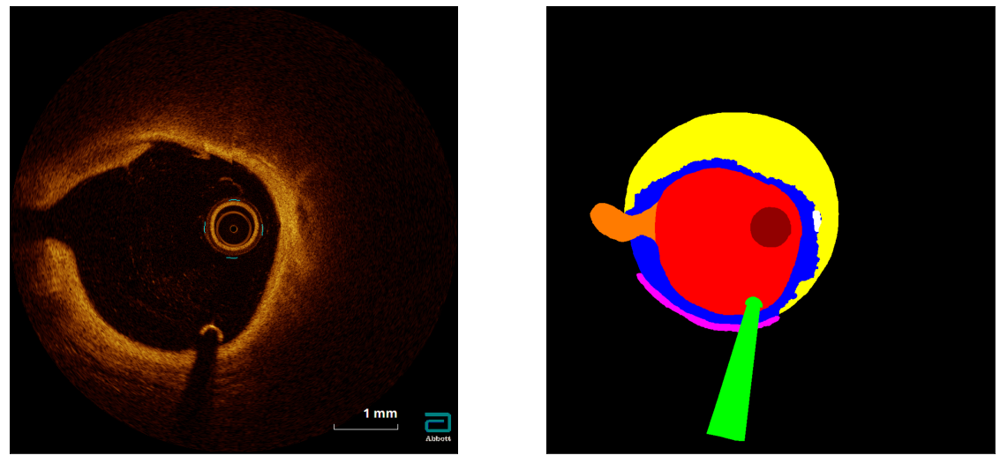

# CardiacOCT project

## Project description

Acute myocardial infarction (MI) remains as one of the leading causes of mortality in the developed world. Despite huge advances in treating this condition such as the use of angiograms to locate the occluded artery or coronary angioplasty, there is still a debate on whether to treat certain lesions found during coronary angiography or not, since it is difficult to predict which plaques would have a worse outcome for the patient’s health. Imaging modalities such as intracoronary optical coherence tomography (OCT) provide a better comprehension of plaque characteristics and it can help surgeons to better asses these lesions, improving patient’s outcome.

In this project, an automatic segmentation model will be designed for intracoronary OCT scans in order to asses for plaque vulnerability and detect other abnormalities such as white or red thrombus or plaque rupture. Specifically, a no-new UNet (nnUNet) that works with sparse annotated data will be designed. Initially, the model will be trained on singles frames that contain a corresponding segmentation map, that is, the model works in a supervised manner. Next, in order to account for the sparse annotations, a 3D UNet will be trained in a semi-supervised manner. After the models have been trained, several automatic post-processing techninques for lipid arc and cap thickness measurement will be implemented. Moreover, an uncertainty estimation model will be designed in order to detect unreliable segmentations and add more value to the algorithm's output.

           
## Dataset

The intracoronary OCT dataset used in this study is a collection of OCT scans from 5 different medical centers: Isala (ISALA, Zwolle), Amphia Hospital (AMPH, Breda), North Estonia Medical Center (NEMC, Tallinn), Den Haag Medical Centrum (HMC, Den Haag) and RadboudUMC (RADB, Nijmegen).

Since the manually labelling of OCT frames is a very time consuming task for annotators, not all scans were included for the training. In particular, the standard methodology is to label each 40th frame in the scan, unless there are some regions in other frames that are necessarily to label. Thus, frames that contain some degree of labelling were included for the training. 

| Dataset  | Nº of patients (train/test) | Nº of pullbacks (train/test) | Nº of annotated frames (train/test)
| ------------- | ------------- | -------------  | -------------
| First dataset  | 49/13 (1 EST-NEMC, 24 AMPH, 3 HMC, 24 ISALA, 10 RADB)  | 56/14  | 783/163
| Second dataset  | 75/13 (1 EST-NEMC, 27 AMPH, 3 HMC, 24 ISALA, 33 RADB)  | 88/14  | 1215/162
| Third dataset  | 100/13 (1 EST-NEMC, 33 AMPH, 3 HMC, 24 ISALA, 52 RADB)  | 118/14  | 1649/162 
| Fourth dataset  | 112/13 (1 EST-NEMC, 33 AMPH, 3 HMC, 24 ISALA, 64 RADB)  | 134/14  | 1846/162 

We show the regions of interest (ROIs) that the algorithm segments. With the aim to understand better the dataset, we obtained the distribution for each ROI among the three datasets that were used in the study. These values can be seen in the following table. 

| ROI  | First dataset (frames/pullbacks)(%) | Second dataset (frames/pullbacks) (%) | Third dataset (frames/pullbacks)(%) | Fourth dataset (frames/pullbacks)(%) | Test set (frames/pullbacks)(%)
| ------------- | ------------- | ------------- | ------------- | ------------- | -------------
| Lumen  | - | - | - | - | -
| Guidewire  | - | - | - | - | -
| Wall | - | - | - | - | -
| Lipid | 51.08 / 98.21 | 46.74 / 97.72 | 47.96 / 96.61 | 48.26 / 97.01 | 48.14 / 92.85 
| Calcium | 27.58 / 83.92 | 27.07 / 81.81 | 31.59 / 83.05 | 32.12 / 84.32 | 16.66 / 71.42
| Media | 94.89 / 100 | 96.21 / 100 | 94.9 / 100 | 95.07 / 100 | 99.38 / 100
| Catheter | - | - | - | - | - | -
| Sidebranch | 13.79 / 85.71 | 14.97 / 89.77 | 15.46 / 89.83 | 15.81 / 88.81 | 16.67 / 71.42 
| Red thrombus | 6.89 / 26.78 | 5.67 / 23.86 | 6.67 / 24.57 | 6.07 / 23.13 | 0.61 / 7.14
| White thrombus | 5.61 / 28.57 | 4.53 / 23.86 | 5.45 / 27.96 | 4.87 / 24.62 | 0 / 0
| Dissection | 0.76 / 5.35 | 0.49 / 3.41 | 0.36 / 2.54 | 0.32 / 2.23 | 0 / 0
| Plaque rupture | 7.02 / 25 | 5.59 / 21.59 | 7.09 / 20.33 | 6.44 / 19.40 | 3.08 / 14.28

Note that the lumen, guidewire, wall and catheter are present in every frame of the datatset.

## Preprocessing

The general preprocessing consisted of reshaping the images to a common size, which was (704, 704) and applying a circular mask to each slice. This is because each slice contains a watermark by Abbott with a small scale bar, and we do not want our algorithm to learn from this information.

### 2D approach

For the 2D approach, the slices that did not contain any label were omitted. Thus, each slice for every pullback in the dataset was saved to a single NifTI file. In addition, each channel in the slice (RGB values) were saved separately as well, obtaining 3 files for each frame in the pullback. Similiary, each segmentation frame was saved in a different NifTI file. In this case, the segmentation is 1-dimensional, so there was no need to create a file for each dimension.

For the first and second training, a linear interpolation resampler was used for both segmentations and images. In the case of the images, a circular mask with radius 340 was applied. Next, each 2D frame was converted to a pseudo 3D scan by including and extra dimension of shape 1, having a final shape of (1, 704, 704). Finally, the spacing and direction of the frame was set to (1.0, 1.0, 1.0) and (1.0, 0.0, 0.0, 0.0, 1.0, 0.0, 0.0, 0.0, 1.0), respectively.

For the third training, a nearest neighbor interpolation sampler was used, since the liner interpolator introduces more artifacts in the frame. After this step, due to missing segmentations on the edge of the frame, a circular mask with radius 346 was applied to both images and segmentation, so the overlap between them is now perfect. Again, the frames were converted to pseudo 3d scans. However, the spacing of the frame was changed to (1.0, 1.0, 999.0), to avoid possible conflicts with calculating the transpose of the image.

### 3D approach

For the 3D version of the nnUNet, a sparse trainer was used. In this case, the loss function is computed using slices that contain annotations in each 3D volume (DC + CE loss). The frames that do not contain any label have a segmentation map that only contains -1, in order for the algorithm to detect unlabeled data. The preprocessing steps are very similar to the 2D model (third training), in which each pullback is separated into its RGB values and each volume is saved separately in different NifTI files. Then, the main difference is that now whole 3D volumes are saved, rather than single 2d frames.

## Training

### nn-UNet

The no-new UNet (nnUNet) is based on the well-known UNet architecture. In this model, an encoder part downsizes the input and increases the number of feature channels, followed by a decoder that takes upsamples the feature maps and reconstructs the original size of the input image. These enconder and decoder networks are also connected by skip connections that allow the decoder to use high-resolution features from the encoder.

The problem with this model is that it needs a very specific input settings and preprocessing the data can be a tedious task. That is why not only the nnUNet uses the U-Net architecture, but also it automatically configures itself, including the preprocessing, network architecture, training and post-processing for any task and data. Hence, while achieving state-of-the-art performances in different tasks, nnUNet adds a systematic framework that can overcome problems and limitations during manual configurations. 

For more information on the nnUNet architecture and processes, see the [original repository](https://github.com/MIC-DKFZ/nnUNet), the [original paper](https://www.nature.com/articles/s41592-020-01008-z) and the [supplementary information](https://static-content.springer.com/esm/art%3A10.1038%2Fs41592-020-01008-z/MediaObjects/41592_2020_1008_MOESM1_ESM.pdf).

## Post-processing

For the post-processing, we desgined algrithms that perform measurements on the calcium and lipid regions:

### Lipid

An algorithm that automatically measures the fibrous cap thickness (FCT: thickness of the wall that delimitates the lipid and the lumen) and the lipid arc was developed. A plaque is usually deemed vulnerable when a thin-cap fibroatheroma (TCFA) appears or there are either cap rupture or thrombus formation. In the case of TCFA, this occurs when there is a lipd arc ≥ 90º and a FCT < 65 µm. That is why the correct measurement of these two values is very important for the correct treatment of the patient.

### Calcium

Similarly, we also developed an algorithm that performs measurements in the calcium region. The script measures the calcium depth (similar as FCT), calcium thickness (the thickness of the biggest calcium plaque, perpendicular to the lumen) and calcium arc (similar as the lipid arc). In this case, the amount of calcium would indicate that the lesion there should be prepared before treating it with a stent. These values are calcium arc > 180º (score of 2 points), thickness > 0.5 mm (1 point). Another parameter which is not included is tbe calcium length (length of the calcium in the longitudinal axis), which  has a threshold of > 5 mm (1 point). This gives a calcium score of 0-4 points. See [Fujino et al.](https://pubmed.ncbi.nlm.nih.gov/29400655/) for more information.

## Results

We obtained several metrics (accuracy, recall, jaccard, etc), but we only diplay the DICE scores for each one of the regions segmented. For the 2D models, the DICE scores computed per frame are showed. In order to accurately compare the 2D models and the 3D model, the DICE scores for the 2D models were computed pullback-wise (i.e the values of the confusion matrix are computed using every pixel in the pullback, rather than for every frame independently). 

### Results of best cross-validation model

| ROI  | Model 1 | Model 2 | Model 3 | Model 4 | 3D sparse model
| ------------- | -------------- | -------------- | -------------- | -------------- | --------------
| Lumen  | 0.977 | 0.979 | 0.987 | 0.987 |
| Guidewire  | 0.919 | 0.924 | 0.947 | 0.946 |
| Wall | 0.883 | 0.892 | 0.901 | 0.899 |
| Lipid | 0.491 | 0.517 | 0.569 | 0.578 |
| Calcium | 0.426 | 0.447 | 0.589 | 0.604 |
| Media | 0.746 | 0.762 | 0.772 | 0.765 |
| Catheter | 0.981 | 0.984 | 0.992 | 0.992 |
| Sidebranch | 0.441 | 0.461 | 0.533 | 0.535 |
| Red thrombus | 0.436 | 0.463 | 0.479 | 0.486 |
| White thrombus | 0.321 | 0.33 | 0.378 | 0.393 |
| Dissection | 0.06 | 0.0004 | 0 | 0 |
| Plaque rupture | 0.471 | 0.429 | 0.542 | 0.527 |

### Results on test set (frame-level)

| ROI  | Model 1 | Model 2 | Model 3 | Model 4 | 3D sparse model
| ------------- | -------------- | -------------- | -------------- | -------------- | --------------
| Lumen  | 0.976 | 0.978 | 0.981 |0.981 |
| Guidewire  | 0.926 | 0.926 | 0.949 | 0.95 | 
| Wall | 0.87 | 0.883 | 0.89 | 0.892 |
| Lipid | 0.5 | 0.594 | 0.596 | 0.617 |
| Calcium | 0.283 | 0.292 | 0.544 | 0.531 |
| Media | 0.756 | 0.767 | 0.784 | 0.787 |
| Catheter | 0.988 | 0.988 | 0.989 | 0.989
| Sidebranch | 0.518 | 0.564 | 0.592 | 0.542
| Red thrombus | 0 | 0.039 | 0.094 | 0.324 
| White thrombus | 0 | NaN | 0 | 0
| Dissection | NaN | NaN | NaN | NaN
| Plaque rupture | 0.48 | 0.587 | 0.605 | 0.607

Note that for the test set, there are no frames with white thrombus or dissections, meaning that the best prediction for these regions would be NaN (i.e no false positives with white thrombus or dissection). Again, we see a great increase in lipid and calcium from the second dataset to the third dataset. We think that the different pre-processing techniques may have played an important role in the outcome of the third model

### Results on test set (pullback-level)

| ROI  | 2D model 1st dataset | 2D model 2nd dataset | 2D model 3rd dataset | 3D model sparse
| ------------- | -------------- | -------------- | -------------- | --------------
| Lumen  | 0.981 | 0.982 | 0.985
| Guidewire  | 0.927 | 0.927 | 0.95
| Wall | 0.87 | 0.896 | 0.9
| Lipid | 0.691 | 0.709 | 0.694
| Calcium | 0.502 | 0.523 | 0.58
| Media | 0.784 | 0.786 | 0.799
| Catheter | 0.988 | 0.988 | 0.989
| Sidebranch | 0.67 | 0.725 | 0.764
| Red thrombus | 0 | 0.088 | 0.094
| White thrombus | 0 | NaN | 0
| Dissection | NaN | NaN | NaN
| Plaque rupture | 0.303 | 0.369 | 0.378 

### Lipid arc DICE

Inspired by the approaches in the study by [Lee et al. (2022)](https://www.nature.com/articles/s41598-022-24884-1), we calculated the DICE scores for the lipid arc. This way, we obtain a more insightful measure to asses the model performance (the previous DICE were computed pixel-label). The following table shows these DICE scores for the test set using the prediction given by the three 2D models that we have up to now. An average over the DICE scores for each frame is shown.

Model | Lipid arc frame-level | Lipid arc pullback-level
| ------------- | -------------- | --------------
| Model 1 | 0.666 | 0.804
| Model 2 | 0.759 | 0.834
| Model 3 | 0.767 | 0.827
| Model 4 | 0.768 | 0.842

### Calcium arc DICE

Similar as with the lipid arc, we computed the DICE for the detected arc of the biggest calcium region that appears in the frame. We also computed the DICE per frame and per pullback.

Model | Calcium arc frame-level | Calcium arc pullback-level
| ------------- | -------------- | --------------
| Model 1 | 0.541 | 0.613
| Model 2 | 0.605 | 0.607
| Model 3 | 0.661 | 0.694
| Model 4 | 0.638 | 0.703

### Post processing results

For the post-processing results, we report the Bland-Altman analysis and intra-class correlation (ICC) for the measurements on the predictions and the manual measurements.

#### Lipid measurements

| Model  | FCT (mean diff / SD) (µm) | Lipid arc (mean diff / SD) (º) | FCT ICC(2,1) | Lipid arc ICC(2,1)
| ------------- | -------------- | -------------- | -------------- | -------------- 
| 1  | 29.71 ± 72.36 | 5.87 ± 30.32 | 0.821 | 0.877
| 2  | 18.1 ± 74.11 | 1.17 ± 24.64 | 0.825 | 0.914
| 3  | 37.66 ± 95.63 | -2.25 ± 22.04 | 0.714 | 0.932
| 4  | 28.72 ± 95.52 | -2.7 ± 22.46 | 0.73 |0.929

#### Calcium measurements

| Model  | Depth (mean diff / SD) (µm) | Calcium arc (mean diff / SD) (º) | Thickness (mean diff /SD) (µm) | Depth ICC(2,1) | Calcium arc ICC(2,1) | Thickness ICC(2,1)
| ------------- | -------------- | -------------- | -------------- | -------------- | -------------- | -------------- 
| 1  | -15.22 ± 70.21 | -6.26 ± 13.69 | -92.39 ± 223.31 | 0.748 | 0.898 | 0.757 
| 2  | -7.5 ± 42.14 | -6.58 ± 14.12 | -51.79 ± 177.36 | 0.922 | 0.891 | 0.858
| 3  | 10.38 ± 66.21 | -8.77 ± 15.33 | -77.15 ± 177.6 | 0.863 | 0.861 | 0.851
| 3  | 11.85 ± 52.01 | -8.08 ± 13.32 | -83.04 ± 164.6 | 0.908 | 0.828 | 0.868

## TODO:
 - Solve problem with DA
 - Do 3D training with the selective volumes (3 frames and/or k-neighbors approach)
 - Get ideas from [Lee et al. (2022)](https://www.nature.com/articles/s41598-022-24884-1) and [Wang et al. (2012)](https://www.ncbi.nlm.nih.gov/pmc/articles/PMC3370980/) for maybe more exact post processing measurements.
 - Dive into probability maps for uncertainty estimation

